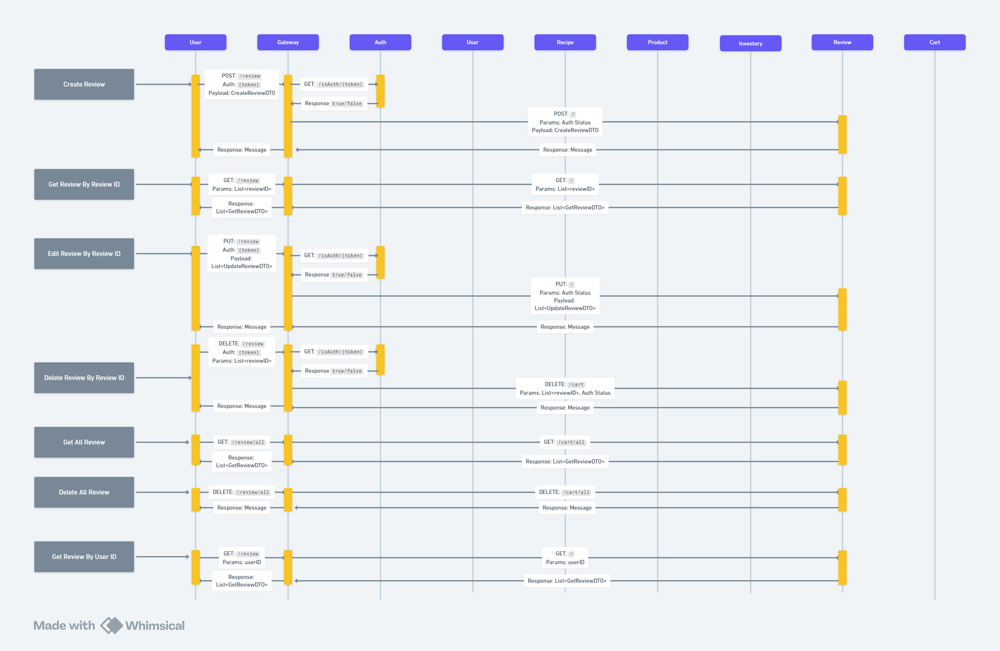

# Requirements
https://whimsical.com/requirement-9rzr43g5Sh9yN3LK7VMkCo

### Main Idea:

This is microservice where user can create, login, view, edit, delete and share their recipe and products, also user browse, like and review recipe and buy, browse, review products

### ER Diagram:
### User And Auth Sequence Diagram:
### Recipe Sequence Diagram:
### Product Sequence Diagram: 
### Inventory Sequence Diagram: 
### Cart Sequence Diagram: 
### Review Sequence Diagram: 